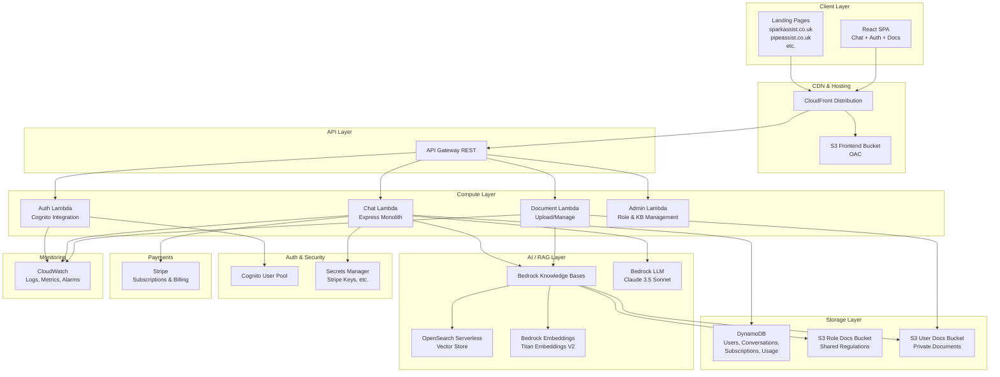

# TradeAssist — Architecture

## System Overview

TradeAssist is a serverless, multi-tenant SaaS platform built on AWS. It provides role-specific AI assistants for trade professionals, powered by RAG (Retrieval-Augmented Generation) using AWS Bedrock. The system supports multiple branded products (e.g., SparkAssist for electricians) under a single codebase, with per-user private knowledge bases alongside shared role-specific document collections.

---

## System Architecture Diagram



---

## Component Breakdown

### 1. Frontend (React SPA)
**Responsibility**: User interface for all interactions — landing pages, authentication, chat, document management, billing.

- **Technology**: React 18 + TypeScript + Vite
- **Styling**: Emotion + MUI with dynamic theming per role
- **State**: Zustand for global state, TanStack Query for server state
- **Auth**: Cognito integration via AWS Amplify Auth
- **Hosting**: S3 + CloudFront with OAC
- **Key Features**:
  - Dynamic role-specific landing pages driven by config
  - Real-time chat interface with streaming responses
  - Document upload and management
  - Subscription management via Stripe Checkout

### 2. API Gateway
**Responsibility**: Single entry point for all API requests with authentication, rate limiting, and CORS.

- **Type**: REST API
- **Auth**: Cognito User Pool Authorizer
- **Rate Limiting**: Per-user throttling based on subscription tier
- **CORS**: Configured for all role-specific domains

### 3. Chat Lambda (Express Monolith)
**Responsibility**: Core business logic — chat processing, RAG queries, conversation management, user management.

- **Technology**: Node.js + Express + TypeScript
- **Deployment**: Lambda via serverless-http
- **Key Routes**:
  - `POST /chat` — Send message, get AI response
  - `GET /conversations` — List user conversations
  - `GET /conversations/:id` — Get conversation history
  - `DELETE /conversations/:id` — Delete conversation
  - `GET /users/me` — Get current user profile
  - `PATCH /users/me` — Update user profile

### 4. Document Lambda
**Responsibility**: Handle user document uploads, management, and knowledge base synchronisation.

- **Key Routes**:
  - `POST /documents/upload` — Upload document (presigned URL)
  - `GET /documents` — List user documents
  - `DELETE /documents/:id` — Delete document
  - `POST /documents/sync` — Trigger KB re-sync

### 5. Admin Lambda
**Responsibility**: Administrative functions — role management, shared KB document management, analytics.

- **Key Routes**:
  - `POST /admin/roles` — Create/update role configuration
  - `POST /admin/documents` — Upload shared role documents
  - `GET /admin/analytics` — Usage analytics

### 6. Bedrock Knowledge Bases (RAG Engine)
**Responsibility**: Vector search over role-specific and user-specific documents.

- **Architecture**:
  - One Knowledge Base per role (shared documents)
  - One Knowledge Base for user private documents (filtered by userId metadata)
  - OpenSearch Serverless as the vector store
  - Titan Embeddings V2 for document embedding
- **Query Flow**:
  1. User sends question with role context
  2. System queries shared role KB + user's private KB
  3. Retrieved chunks are merged and ranked
  4. Combined context + system prompt + user question → Bedrock LLM
  5. LLM generates grounded response with citations

### 7. Bedrock LLM
**Responsibility**: Generate natural language responses grounded in retrieved context.

- **Model**: Claude 3.5 Sonnet (via Bedrock)
- **System Prompts**: Role-specific prompts that define persona, expertise, and response format
- **Features**: Streaming responses, citation of source documents

### 8. DynamoDB Tables
**Responsibility**: Persistent storage for all application data.

- **Tables**:
  - `Users` — User profiles, roles, subscription tier
  - `Conversations` — Chat conversation metadata
  - `Messages` — Individual chat messages
  - `Documents` — User document metadata
  - `Usage` — Daily/monthly usage tracking
  - `Subscriptions` — Stripe subscription data

### 9. S3 Buckets
**Responsibility**: Object storage for documents and frontend assets.

- **Buckets**:
  - `tradeassist-frontend` — React SPA build artifacts
  - `tradeassist-role-docs` — Shared role regulation documents
  - `tradeassist-user-docs` — User-uploaded private documents
  - `tradeassist-logs` — Access logs

### 10. Cognito
**Responsibility**: User authentication and authorization.

- **Features**: User pools, email verification, password policies, JWT tokens
- **Integration**: API Gateway authorizer + frontend auth flows

### 11. Stripe
**Responsibility**: Subscription billing and payment processing.

- **Products**: Free, Pro (£9.99/mo), Business (£29.99/mo)
- **Integration**: Webhooks for subscription lifecycle events

---

## Data Flow

### Chat Request Flow
```
1. User types question in chat UI
2. Frontend sends POST /chat with { message, conversationId, roleSlug }
3. API Gateway validates Cognito JWT
4. Chat Lambda receives request
5. Lambda queries Bedrock KB (shared role KB)
6. Lambda queries Bedrock KB (user private KB, filtered by userId)
7. Retrieved document chunks are merged and ranked by relevance
8. System prompt (role-specific) + context + user message → Bedrock LLM
9. LLM streams response back through Lambda → API Gateway → Frontend
10. Message + response saved to DynamoDB (Messages table)
11. Usage counter incremented (Usage table)
```

### Document Upload Flow
```
1. User selects file in Document Management UI
2. Frontend requests presigned S3 URL via POST /documents/upload
3. Document Lambda validates tier limits, generates presigned URL
4. Frontend uploads file directly to S3 (user-docs bucket)
5. S3 event triggers document processing
6. Document metadata saved to DynamoDB (Documents table)
7. Bedrock KB data source sync triggered (user's documents)
8. Document becomes available for RAG queries
```

---

## Technology Stack

| Layer | Technology | Version |
|-------|-----------|---------|
| Frontend | React + TypeScript | 18.x |
| Build Tool | Vite | 5.x |
| UI Library | MUI (Material UI) | 5.x |
| Styling | Emotion | 11.x |
| State | Zustand | 4.x |
| Data Fetching | TanStack Query | 5.x |
| Forms | Formik + Yup | 2.x / 1.x |
| i18n | react-i18next | 14.x |
| Backend | Node.js + Express + TypeScript | 20.x / 4.x |
| Validation | Joi | 17.x |
| LLM | AWS Bedrock (Claude 3.5 Sonnet) | - |
| Embeddings | AWS Bedrock (Titan Embeddings V2) | - |
| Vector Store | OpenSearch Serverless | - |
| RAG | Bedrock Knowledge Bases | - |
| Database | DynamoDB | - |
| Auth | Cognito User Pools | - |
| Storage | S3 | - |
| CDN | CloudFront | - |
| Payments | Stripe | - |
| IaC | SAM CLI + CloudFormation | - |
| CI/CD | GitHub Actions | - |
| Monitoring | CloudWatch | - |

---

## Infrastructure

### Environments
- **Development**: Local development with SAM CLI local
- **Staging**: Full AWS deployment for testing
- **Production**: Full AWS deployment with monitoring and alarms

### Deployment Strategy
- SAM CLI for infrastructure deployment
- `aws s3 sync` for frontend deployment
- CloudFront invalidation post-deploy
- GitHub Actions for CI/CD pipeline

### Multi-Domain Strategy
- Single CloudFront distribution
- CloudFront Functions for domain-based routing
- Each role brand can have its own domain (e.g., sparkassist.co.uk)
- All domains serve the same React SPA, which reads the domain/path to determine role context

---

## Security Considerations

- **Authentication**: Cognito JWT tokens validated at API Gateway level
- **Authorization**: Tier-based access control in Lambda middleware
- **Data Isolation**: User documents stored in isolated S3 prefixes (`/userId/`)
- **Encryption**: S3 SSE-S3, DynamoDB encryption at rest, HTTPS everywhere
- **Secrets**: Stripe API keys and other secrets in AWS Secrets Manager
- **CORS**: Restricted to known domains
- **Rate Limiting**: API Gateway throttling + application-level per-user limits
- **Input Sanitization**: Joi validation on all inputs
- **CSP Headers**: Content Security Policy via CloudFront response headers

---

## Scalability Notes

- **Serverless-first**: Lambda, DynamoDB, S3, OpenSearch Serverless all auto-scale
- **Per-role KBs**: Each role has its own Knowledge Base, allowing independent scaling
- **DynamoDB on-demand**: Pay-per-request pricing, no capacity planning needed
- **CloudFront caching**: Landing pages and static assets cached at edge
- **Geographic expansion**: New regions = new document sets in S3, new KB data sources
- **Role expansion**: Adding a new role = new config JSON + new S3 document folder + new KB data source

---

## Key Components and Their Interactions

```
Frontend ←→ CloudFront ←→ API Gateway ←→ Lambda (Express)
                                              ↓
                                    ┌─────────┼─────────┐
                                    ↓         ↓         ↓
                                DynamoDB   Bedrock    S3
                                              ↓
                                    ┌─────────┼─────────┐
                                    ↓         ↓         ↓
                              Knowledge   Claude 3.5  OpenSearch
                                Bases     Sonnet     Serverless
```

---

## External Dependencies

| Dependency | Purpose | Management |
|-----------|---------|------------|
| AWS Bedrock | LLM + RAG | Managed service, model access via API |
| Stripe | Payments | API integration, webhook events |
| OpenSearch Serverless | Vector store | Managed by Bedrock KB |
| Cognito | Auth | Managed service |
| CloudFront | CDN | Managed service |

---

## Additional Documentation

- `API_SCHEMA.md` — Full API endpoint documentation
- `TOOLS_AND_TECH.md` — Detailed technology choices and justifications
- `DECISIONS.md` — Architecture Decision Records
- `TASK_LOG.md` — Current and completed work tracking
